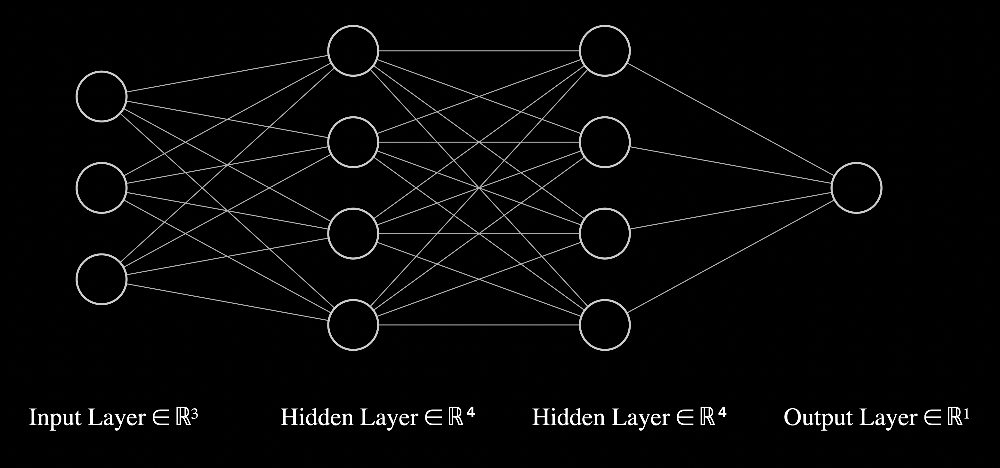

<p align="center">

</p>

<p align="center"><strong>Positron builder</strong></b>

<br />

<p align="center">This project is my tiny (very tiny) deep neural network framework.</p>

<p align="center">
You can create your custom neural nets with this library. I currently have the implementation of one of the simplest ANN architectures, the Multi-Layer Perceptron (MLP). I expect to add more architectures in the near future. If you want to see the usage of the MLP class, here is an example of training and prediction with it:

```py
# Input data
X = [
  [2.0, 3.0, -1.0],
  [3.0, -1.0, 0.5],
  [0.5, 1.0, 1.0],
  [1.0, 1.0, -1.0],
]

# Expected outputs
Y = [1.0, -1.0, -1.0, 1.0]

# Build an Multi-Layer Perceptron with 4 layers:
# layer 1: 3 neurons (input layer)
# layer 2: 4 neurons (hidden layer)
# layer 3: 4 neurons (hidden layer)
# layer 4: 1 neuron (output layer)
positron = MLP(3, [4, 4, 1])

# Train the network
positron.train(X, Y, 300, 0.1)

print("\nRESULTS:\n")

# Test the network
results = positron.predict(X)

for result in results:
  print(result)
```

output:

```txt
-- Training steps --
...
289: 0.0010935493576445503
290: 0.0010894371864003474
291: 0.0010853549110994179
292: 0.0010813022102643681
293: 0.0010772787669862892
294: 0.0010732842688441825
295: 0.0010693184078260066
296: 0.0010653808802514604
297: 0.001061471386696338
298: 0.001057589631918434
299: 0.001053735324785059
300: 0.0010499081782020313

RESULTS:

Value(data=0.9870364150114223, label="", parents=())
Value(data=-0.9848297251099126, label="", parents=())
Value(data=-0.9827992534310097, label="", parents=())
Value(data=0.9812369924980958, label="", parents=())
```

This would be the visualization of the MLP created:

<p align="center">

</p>